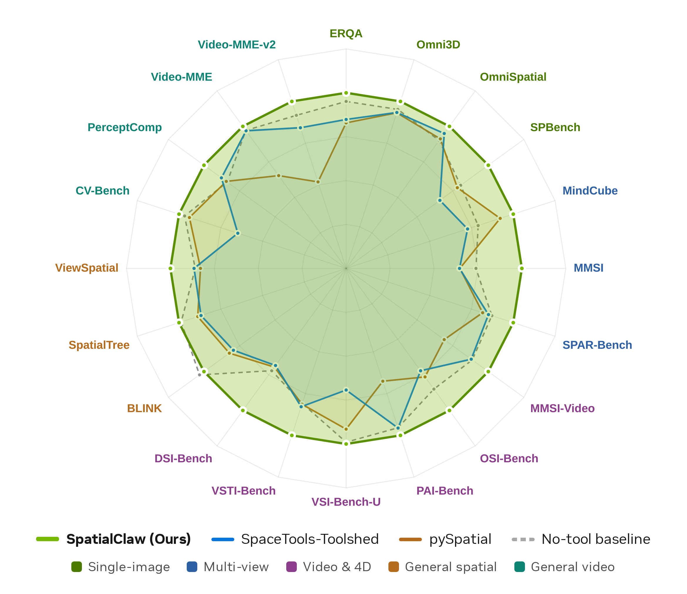

<div align="center">


# SpatialClaw

### Rethinking the Action Interface for Agentic Spatial Reasoning

**_Code is the right action interface for spatial reasoning agents._**

[**Seokju Cho**](https://seokju-cho.github.io/)<sup>1,2</sup>, [**Ryo Hachiuma**](https://ryohachiuma.github.io/)<sup>1</sup>, [**Abhishek Badki**](https://abadki.github.io/)<sup>1</sup>, [**Hang Su**](https://suhangpro.github.io/)<sup>1</sup>, [**Byung-Kwan Lee**](https://byungkwanlee.github.io/ByungKwanLee-CV/)<sup>1</sup>, [**Chan Hee Song**](https://chanh.ee/)<sup>1</sup>, [**Sifei Liu**](https://sifeiliu.net/)<sup>1</sup>,<br/>
[**Subhashree Radhakrishnan**](https://subhashree-r.github.io/)<sup>1</sup>, [**Seungryong Kim**](https://cvlab.kaist.ac.kr/)<sup>2</sup>, [**Yu-Chiang Frank Wang**](https://vllab.ee.ntu.edu.tw/ycwang.html)<sup>1</sup>, [**Min-Hung Chen**](https://minhungchen.netlify.app/)<sup>1</sup>

<sup>1</sup>**NVIDIA** &nbsp;&nbsp;·&nbsp;&nbsp; <sup>2</sup>**KAIST AI**

<sub>Work done during Seokju Cho's internship at NVIDIA.</sub>

<br/>

[](https://spatialclaw.github.io)
[](https://spatialclaw.github.io/static/pdfs/spatialclaw.pdf)
[](https://github.com/NVlabs/SpatialClaw)
[](#citation)

<br/>



</div>

---

> **TL;DR.** SpatialClaw is a **training-free** spatial reasoning framework that treats **code as the action interface**: a VLM-backed agent writes one Python cell per step into a persistent Jupyter kernel pre-loaded with perception primitives (SAM3 segmentation, Depth-Anything-3 reconstruction, geometry utilities) and scientific libraries (NumPy, SciPy, Matplotlib). Each cell can compose tool outputs, inspect intermediate evidence, and revise the analysis before committing an answer with `ReturnAnswer(...)`. Across **20 spatial reasoning benchmarks**, SpatialClaw reaches **59.9% average accuracy**, outperforming the prior best spatial agent by **+11.2 points** — with the **same** system prompt, tool set, and hyperparameters across all benchmarks and six VLM backbones (Qwen3.5/3.6, Gemma4) from 26B to 397B parameters.

<details>
<summary><b>📄 Abstract</b></summary>

<br/>

Spatial reasoning — the ability to determine where objects are, how they relate, and how they move in 3D — remains a fundamental challenge for vision-language models (VLMs). Tool-augmented agents attempt to address this by augmenting VLMs with specialist perception modules, yet their effectiveness is bounded by the *action interface* through which those tools are invoked. In this work, we study how the design of this interface shapes the agent's capacity for open-ended spatial reasoning. Existing spatial agents either employ single-pass code execution, which commits to a full analysis strategy before any intermediate result is observed, or rely on a structured tool-call interface that often offers less flexibility for freely composing operations or tailoring the analysis to each task. We therefore propose **SpatialClaw**, a training-free framework for spatial reasoning that adopts code as the action interface. SpatialClaw maintains a stateful Python kernel pre-loaded with input frames and a suite of perception and geometry primitives, letting a VLM-backed agent write one executable cell per step conditioned on all prior outputs, enabling the agent to flexibly compose and manipulate perception results and adapt its analysis to both intermediate text and visual observations and the demands of each problem. Evaluated across 20 spatial reasoning benchmarks spanning a broad range of static and dynamic 3D/4D spatial reasoning tasks, SpatialClaw achieves 59.9% average accuracy, outperforming the recent spatial agent by **+11.2 points**, with consistent gains across six VLM backbones from two model families without any benchmark- or model-specific adaptation.

</details>

> 🔍 **What this repo contains.** This is the **official implementation** of the paper. It includes the full agent runtime (LangGraph workflow, persistent Jupyter kernel, AST safety check, planning/reflection loops), all 20 benchmark loaders, perception tool wrappers, a FastAPI-served GPU tool server, vLLM auto-discovery and load balancing, a **llama.cpp backend for GGUF-quantized models**, and the SLURM launch managers used to reproduce every experiment in the paper.

---

## How It Works

For every sample, SpatialClaw runs a **five-stage loop** on top of a persistent Python kernel: a planner drafts a strategy, the main VLM writes one Python cell per step, the cell is AST-checked and executed in a stateful kernel, and stdout / new variables / `show()` images flow back as the next observation — repeating until the agent commits with `ReturnAnswer(...)`.

<p align="center">
  
</p>

At runtime, three independent services — an **LLM backbone** (vLLM or llama.cpp), a **GPU perception-tool server** (Reconstruct / SAM3), and the **agent** (Jupyter kernels) — coordinate through shared JSON registries and survive SLURM job-time limits via auto-restarting chain jobs. No SLURM cluster? Each service is also a plain entry point you can run on any GPU machine.

➡ Full details: **[docs/architecture.md](docs/architecture.md)**

---

## Quickstart

```bash
# 1. Clone with submodules and install (agent + vLLM envs, ~15–30 min)
git clone --recursive https://github.com/NVlabs/SpatialClaw.git
cd SpatialClaw
bash spatial_agent/scripts/setup.sh

# 2. Add API keys — or use self-hosted vLLM with no key
cp .env.example .env        # then edit

# 3. Run an experiment (single machine, no SLURM)
python -m spatial_agent.entrypoints.run \
    --dataset spatial_agent/config/dataset/erqa.json \
    --model   spatial_agent/config/model/gemini-3-pro.json \
    --concurrency 4
```

> Pre-downloading model weights is **mandatory** before SLURM runs, and the vLLM/SLURM setup has extra steps — see **[Installation](docs/installation.md)** and **[Running experiments](docs/running.md)**.

---

## Documentation

| Guide | Contents |
|-------|----------|
| 📦 [Installation](docs/installation.md) | Prerequisites, conda / vLLM environments, third-party submodules, API keys & `.env` |
| 🚀 [Running experiments](docs/running.md) | SLURM setup, pre-downloading weights, launch managers & direct CLI, reproducing paper tables |
| 📊 [Monitoring & logs](docs/monitoring.md) | Dashboards, SLURM logs, per-sample outputs, stopping services |
| ⚙️ [Configuration](docs/configuration.md) | Model / dataset JSON configs, env-var overrides, supported benchmarks |
| 🧠 [Architecture](docs/architecture.md) | Agentic loop, three-service runtime, directory structure |
| 🛠️ [Troubleshooting](docs/troubleshooting.md) | Common errors and fixes |

---

## Supported Benchmarks

All 20 paper benchmarks ship as ready-to-run dataset configs under `spatial_agent/config/dataset/`:

| Category                          | Benchmarks                                                            |
|-----------------------------------|----------------------------------------------------------------------|
| Single-image spatial reasoning    | ERQA, Omni3D, OmniSpatial, SPBench                                    |
| Multi-view spatial reasoning      | MindCube, MMSI, SPAR-Bench                                            |
| General spatial reasoning         | BLINK, SpatialTree, ViewSpatial                                      |
| Video spatial & 4D reasoning      | MMSI-Video, OSI-Bench, PAI-Bench, VSI-Bench-U, VSTI-Bench, DSI-Bench  |
| General video understanding       | CV-Bench, PerceptComp, Video-MME, Video-MME-v2                       |

Details and per-benchmark loaders: **[docs/configuration.md](docs/configuration.md#supported-benchmarks)**.

---

## Citation

If you find SpatialClaw useful, please cite the paper:

```bibtex
@article{cho2026spatialclaw,
  title   = {SpatialClaw: Rethinking Action Interface for Agentic Spatial Reasoning},
  author  = {Cho, Seokju and Hachiuma, Ryo and Badki, Abhishek and
             Su, Hang and Lee, Byung-Kwan and Song, Chan Hee and
             Liu, Sifei and Radhakrishnan, Subhashree and Kim, Seungryong and
             Wang, Yu-Chiang Frank and Chen, Min-Hung},
  journal = {arXiv preprint},
  year    = {2026}
}
```

## Licenses

Copyright © 2026, NVIDIA Corporation. All rights reserved.

This work is made available under the NVIDIA Source Code License-NC. Click [here](LICENSE) to view a copy of this license.

This work will download and install additional third-party open source software projects. 
Review the license terms of these open source projects before use (see the corresponding `tools/third_party/<repo>/LICENSE`)